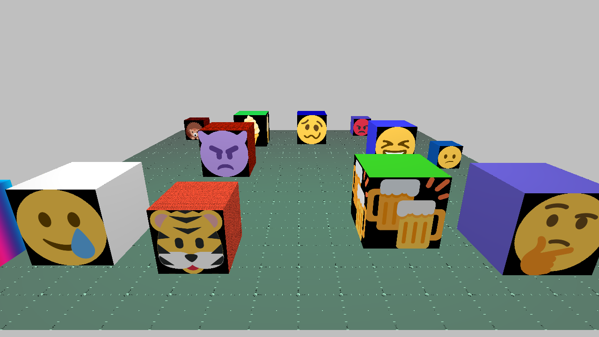
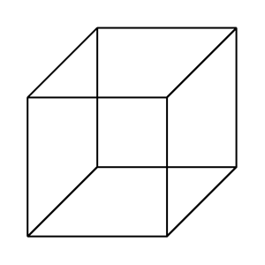

# Neckerworld - A Computer Vision Game



## Overview

Neckerworld is a computer vision game designed to teach students about human and computer vision systems, object detection and identification, visual field construction, autonomous movement and strategy.

All players and resources in the game are cubes.
The cube players are guided solely through autonomous computer vision programs.
No human manual control or input is permitted during gameplay.

To sucessfully play the game requires a competent program to do object detection and identification, playing field knowledge representation and strategic decision making.

## Background

The Necker Cube Illusion (first published as a rhomboid in 1832 by Swiss crystallographer Louis Albert Necker) is a well known example of a perceptual illusion where the orientation of the cube is unstable and easily flips between two states.
Serious study and research into why we perceive multiple states leads to a set of questions about the very nature of our vision.



Further, cubes are very simple objects which can be used to illustrate many other aspects of human and computer vision, such as the effects of contours, shading, texture, occlusion, size-constancy and more.

Components within the Neckerworld programs allow an instructor to easily construct many of these examples and allows students to learn a lot about visual perception.

## The Game

Visual Systems are very different.
They are uniquely engineered to serve the needs of the organism.
They have evolved over 100's of millions of years.
The human visual system serves humans well, but not zebras, owls, rats, bees, or spiders.

## Objectives

Three guiding principles of the human visual system:
* Finding water and food to eat
* Don't get eaten
* Find a mate

Consquently, game points are scored through three activities:
* Finding and reaching food/liquid resources
* Killing off predators
* Mating and having child cubes

There are five types of players in the game.


The male, female and enby players are controlled remotely and autonomously via programs created by the game participants.
The predators and resources are provided by and controlled by the gaming field server.

An IRL analogy would be a bumper-car ride at an amusement park where we would attach a forward looking camera to the front of each car.
Then, by a radio remote-control link, our computer would receive images from the camera and send commands to drive the bumper-car left or right, forward or backward.
The bumper-car would then have to pursue or avoid other cars based on color, appearance and game strategy.

## Game Architecture and Structure

The Neckerworld consists of a playing field server and one or more remote client players.
The server places predators and food resources on the field and controls their activity and movement.
The client player programs exchange messages (JSON files) with the server:
* Messages to the server request new field images to be returned and specify cube movement and rotation.
* Messages from the server supply current cube status, location, speed, and the cube's-eye view of the playing field.

The client players and programs can be on any computer running any operating system with any programming language.


## Installation

Follow these steps to create and install the game server:
```
# If you installed from the github zip file, rename the top-level directory:
mv Neckerworld-main Neckerworld
# Compile the multi-thread server code (has some errors)
cd ~/Neckerworld/server/mtserver/mtserver
make
cd ~/Neckerworld/server
make
# Start the server with a playing-field file
cube ~/Neckerworld/setup/nwtest.json
# To activate predators	on the playing field select the	server window and type "S"
# This will enable the server's basic strategy (control of predators and resources).
S
# In a separate window start the player program
# Make sure port 2020 is open and not firewalled
cd ~/Neckerworld/client
nwplay.py

```

## Object Identification and Training

A crucial element of this game is the proper identification of cube objects and positions.
Each client player needs to scan the environment and identify friends, foes, mates and energy (food) resources.
This requires that each received cube's-eye image is run through an object detection and identification program to determine what's in the visual field.

Current solutions for this type of problem use a neural network trained on the visual objects of interest.
This repository provides two pre-trained neural network models that may be used for game play.
The models run out-of-the-box with a Tensorflow-2 programming environment.

Training a neural network on cube objects is a non-trivial undertaking and currently code to do that is not provided here.
However, image samples and a label dataset suitable for training is contained within the training directory and provides an accelerated start to developing a preferred neural network model.
More solutions for training will, hopefully, be forthcoming.

## Requirements

The server has only been tested on Ubuntu 20.04.6 LTS and Ubuntu 22.04.3 LTS. The desktop edition is required as both the server code and player will open a graphical window to function. 

The following packages are needed to compile and run these programs:
* python3
* python3-pip
* python3-tk
* python3-opencv
* python3-matplotlib
* libglfw3 libglfw3-dev
* mesa-utils libglu1-mesa-dev mesa-common-dev
* freeglut3 freeglut3-dev
* libglew-dev libglm-dev
* libpng-dev
* make cmake pkg-config
* g++
* imagemagick
* tensorflow
* xlib

See script "requirements.sh" for details.

## License

All programs and materials in this repository are under the MIT License.
The MIT license is a simple open source license agreement that grants users the right to reuse code for any purpose, including inside proprietary software, which sets it apart from a Copyleft license.

See: https://mit-license.org and https://en.wikipedia.org/wiki/MIT_License for more information.

## Acknowledgement and Credits

The following repositories have provided code for this project
* mtserver - https://github.com/vichargrave/threads.git and wqueue and tcpsockets
* rapidjson - THL A29 Limited, a Tencent company, and Milo Yip. All rights reserved.
* stb_image - v2.23 - public domain image loader - http://nothings.org/stb
* twemoji - https://github.com/twitter/twemoji/

## Issues

This game is still in an early stage of development and many aspects of the server and client need to be improved.
The author is very interested in feedback and comments related to interest and applicability of this work.
There is, to the author's knowledge, only one similar effort to build a game where programmed automata are the only players, and that is a racing car game.
Future efforts to continue and enhance this game concept will, in part, depend on the feedback received.

* Multi-thread context switching -- Messages can be received at the server in random order and at random times. Each messages that requests a cube's-eye view needs a proper context switch of the rendering engine. Right now this is done through a hack.
* Rendering synchronization -- Code that insures that a proper render is sent back to the client is not well understood and not tested for a large number of clients.
* Cube intersection errors -- The display of cubes that are in close proximity sometimes shows unwanted overlap and incorrect physical display.
