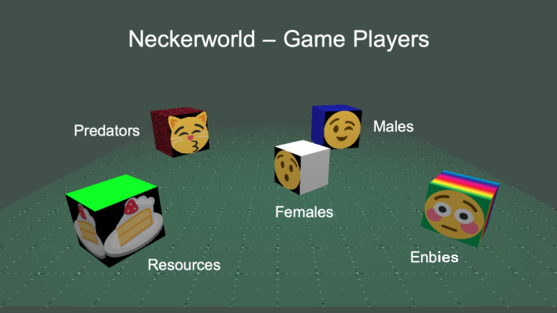

# Neckerworld - A Computer Vision Game

## Overview

Neckerworld is a computer vision game designed to teach students about human and computer vision systems, object detection and identification, visual field construction, autonomous movement and strategy.

All players and resources in the game are cubes.
The cube players are guided solely through autonomous computer vision programs.
No human manual control or input permitted.

To sucessfully play the game requires a competent program to do object detection and identification, playing field knowledge representation and strategic decision making.

## Background

The Necker Cube Illusion is a well known example of a perceptual illusion where the orientation of the cube is unstable and easily flips between two states.
Serious study and research into why we perceive multiple states leads to a set of questions about the very nature of our vision.

Further, cubes are very simple objects which can be used to illustrate many other aspects of human and computer vision, such as the effects of contours, shading, texture, occlusion, size-constancy and more.

Components within the Neckerworld programs allow an instructor to easily construct many of these examples and allows students to learn a lot about visual perception.

## The Game

Visual Systems are very different.
They are uniquely engineered to serve the needs of the organism.
They have evolved over 100's of millions of years.
The human visual system serves humans well, but not zebras, owls, rats, bees, or spiders.

### Objectives

Three guiding principals of the human visual system:

>Find something to eat
>
>Don't get eaten
>
>Find a mate

Consquently, game points are scored through three activities:

> Finding and reaching food resources
>
>Killing off predators
>
>Mating and having child cubes

There are five types of players in the game.

The male,female and enby players are controlled remotely and autonomously via programs created by the game participants.
The predators and resources are provided by and controlled by the gaming field server.

## Game Architecture and Structure

## Installation

Follow these steps to create and install the game server:
...
cd server/mtserver/mtserver
make
cd ../..
make

cd ../client
../server/cube nwtest.json

...

## License

All programs and materials are under the MIT License

## Acknowledgement and Credits

The following repositories have provided code for this project

## Issues

* Multi-thread context switching
* Rendering synchronization
* Cube intersection errors
