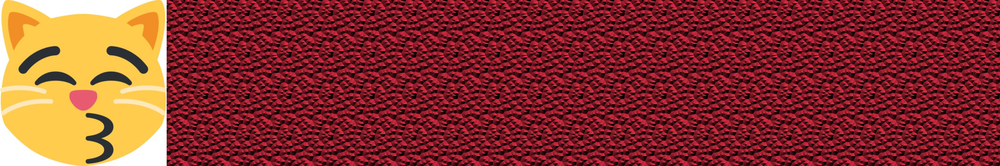

# Neckerworld - A Computer Vision Game

## Overview

The "assets" directory contains graphical images and lists of resources used to construct the game's player cubes.
There are several different classes of assets used.

* svg files contain the original artwork for the emoticons
* png files contain imagery used on the cube surfaces
* surface files contain imagery for the predator skins
* txt files contain lists of players and resources

## Summary of assets

* faces -- png images of all the faces in the game
* patches -- png images of the texture maps needed to render a cube
* predators -- png images of all the predators
* resources -- png images of all the resources (food or energy cubes)
* surfaces -- png images of surfaces (the skin) on predators
* svg -- emoticon definition files
* textures -- texture maps used by opengl to render the surfaces of the cubes
* tw-emoticons -- png images of the emoticons, small scale
* tw-emoticons-512 -- png images of the emoticons as a 512x512 pixel image
* txt files -- final list of enbys, faces, females, male, predators, resources and surfaces in the game

## The standard Neckerworld family

The Neckerworld standard edition contains the followig objects:

* 37 males
* 36 females
*  3 enbys
* 17 predators
* 81 resources

Specifications for each one of these objects is in Neckerworld/training/cubedata.csv and includes details on the emoticon, size, color, surface and standard position of the object.
The texture map, used for surface genertion in opengl, iss found in Neckerworld/training/textures.

