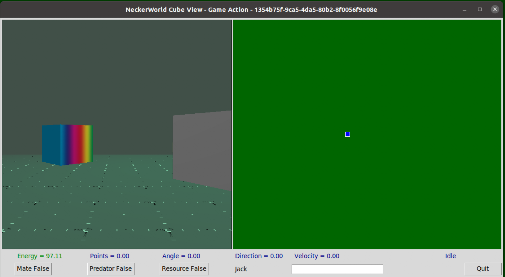

# Neckerworld - A Computer Vision Game



## Overview

The "client" directory contains programs which control the client game player cubes.
Client programs can query the server about the status of its gaming cube, send messages to start movement of the cube into a particular direction, and request the latest visual information from the cube's eye.
As this operation is completely autonomous, the client must use object detection and identification to discover where other cubes are in the playing field, must estimate their distance and direction, and plan a strategy to earn game-play points (killing off predators, finding energy sources and mating).

## Usage

```
./nwplay.py

# To enable sound install playsound and add option -s or --sound
# The playsound module can be used to play MP3 and WAV audio files

pip3 install playsound
./nwplay -s

```

## Summary of programs

### nwplay.py

An example client player written in Python.
The window on the left is the visual field of the cube as rendered by the game server.
The right-hand panel is the client's reconstruction of the 3D space it finds.
Buttons allow the user to test strategies to find predators, food sources and mates.
This program requires an object detection module to function.

### nwmessage.py

A utility program used to send and receive messages to the game server.

### nwvision.py

A module that implements an object detection neural net pre-trained on Neckerworld cubes.
Tensorflow 2 is used for the implementation.
The model creation and training was completed on Google Cloud Services auto-ml.

### nweffdet.py

A module that implements an object detection neural net pre-trained on Neckerworld cubes.
Tensorflow 2 is used for the implementation.
The model creation and training was completed on a PC with a GPU card using the Efficient Detect D0 neural network.

### nwfield.py

A program which can insert new predators or resources into the playing field.
As predators are killed off or resources are used up they need to be replaced during game play.
This program uses the family of predators and the collection of resources to refresh the playing field.
It works remotely, through the messaging system to communicate with the server.

### nwview.py

A utility which allows the server playing field to be viewed remotely.


